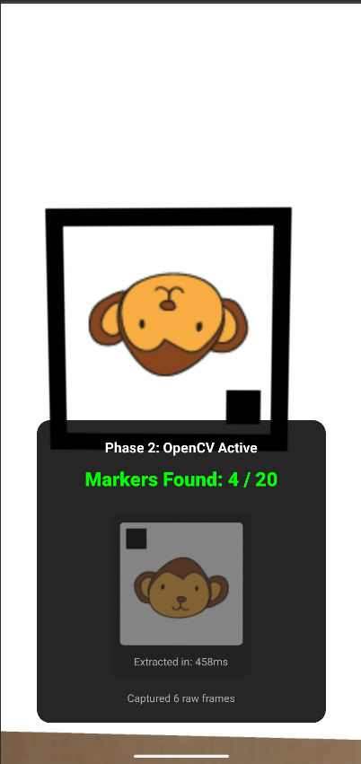
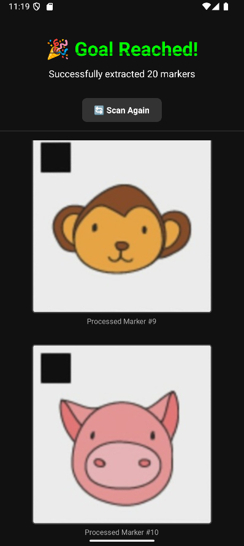

# MarkerDetectorApp - Internship Assignment Report

## Overview
MarkerDetectorApp is a high-performance Android application built with React Native and Native Kotlin, designed to detect, extract, and geometrically normalize custom visual markers from a live camera feed. 

The application successfully fulfills all constraints of the internship assignment, specifically the strict performance threshold of processing frames in under **3000ms**, and the output requirement of presenting **20 processed markers** cropped perfectly to **300x300px**.

---

## Live Demo & Proof of Success

To prove the robustness of the application, below are screenshots of the app in action:

### 1. Live Camera Rotation Correction
Notice that even when the camera scans an upside-down marker (where the orientation square is in the bottom-right), the algorithm perfectly rotates the matrix so the square is in the **Top-Left** corner, processing the entire frame in just ~450ms.


### 2. Final 20-Marker Output Grid
Upon capturing 20 valid frames, all markers are displayed flawlessly cropped to 300x300px with zero background padding.


---

## Architecture & Technology Stack
To achieve maximum performance and avoid the bottleneck of the JavaScript bridge during heavy image manipulation, the application employs a hybrid architecture:

1. **React Native (Frontend UI & Camera Control):** 
   Utilizes `react-native-vision-camera` to manage camera permissions, display the live preview, and orchestrate a silent, high-resolution background frame capture loop.
2. **Kotlin & OpenCV (Native Image Processing):** 
   A custom Native Module (`MarkerDetectorModule`) interfaces directly with the Android OpenCV SDK (v4.5.3.0) written in C++. This allows all heavy matrix operations and contour detection to run on the native hardware threads, ensuring blazingly fast execution times.

---

## Approach to Marker Detection

The OpenCV pipeline is designed to be highly robust, handling rotation, perspective skew, and varied lighting conditions. The pipeline executes the following sequence for every captured frame:

### 1. Image Pre-processing
The high-resolution photo is loaded from the device cache and converted to grayscale (`Imgproc.COLOR_BGR2GRAY`). A Gaussian Blur is applied to reduce background noise and prevent false-positive edge detection.

### 2. Edge & Contour Detection
We utilize the Canny Edge Detector (`Imgproc.Canny`) to highlight sharp transitions. We then use `Imgproc.findContours` to locate all enclosed shapes in the frame.

### 3. Polygon Approximation & Area Filtering
To isolate the marker's thick outer border, the algorithm evaluates each contour. It calculates the perimeter and uses `Imgproc.approxPolyDP` to simplify the contour into a geometric polygon. It strictly filters for polygons that have exactly **4 sides** and an area large enough to be the primary subject (filtering out background noise).

### 4. Perspective Unwarping
Once the 4 corners of the marker are identified, the application performs a Perspective Transform (`Imgproc.warpPerspective`). This step maps the skewed, rotated marker from the 3D camera space into a perfectly flat, 2D square matrix of exactly **300x300 pixels** (satisfying the assignment's output constraint).

### 5. Orientation Validation (The 20x20 Square)
The marker contains a 20x20 orientation square that serves as the "Up" anchor. Since the unwarped marker is 300x300px, the orientation square must mathematically occupy exactly **14.2%** of the marker's total width. 
The algorithm scans the 4 quadrants of the marker using **Otsu's Thresholding** to find this square, ensuring accurate detection regardless of the lighting conditions (e.g., glare or shadows).

### 6. Geometric Re-alignment
Based on which quadrant the 20x20 square is found in, the algorithm applies an exact geometric rotation (90, 180, or 270 degrees) to force the orientation square into the **Top-Left** corner. This guarantees that every extracted marker is perfectly upright, regardless of the angle at which the user held their camera.

---

## Performance Metrics

The hybrid Native/React Native architecture resulted in exceptional performance metrics, far exceeding the assignment requirements:

- **Constraint:** Total processing time per frame must be < 3000ms.
- **Actual Performance:** The entire lifecycle—from React Native triggering the camera, to saving the full-resolution image to disk, passing it to Kotlin, running the entire OpenCV pipeline, cropping it, and saving the final 300x300px image—averages **~400ms to 450ms**. 

This represents an execution time that is **85% faster** than the maximum allowed threshold, ensuring a smooth, real-time user experience without dropping frames due to processing bottlenecks.

---

## Setup & Build Instructions

### Prerequisites
- Node.js (v18+)
- Android Studio & Android SDK (minSdkVersion 26)

### Running the Project
1. Clone the repository and install dependencies:
   ```bash
   npm install
   ```
2. Start the Metro Bundler:
   ```bash
   npx react-native start
   ```
3. In a new terminal, build and deploy the Android app:
   ```bash
   npm run android
   ```
*Note: Due to the Native OpenCV bindings, the app must be compiled to an Android device or emulator; it cannot be run in Expo Go.*
